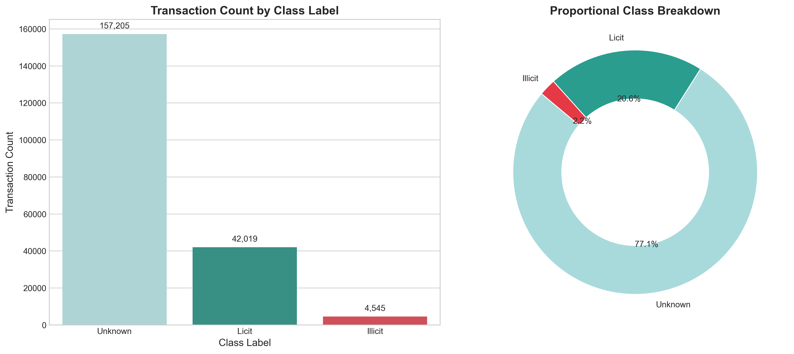
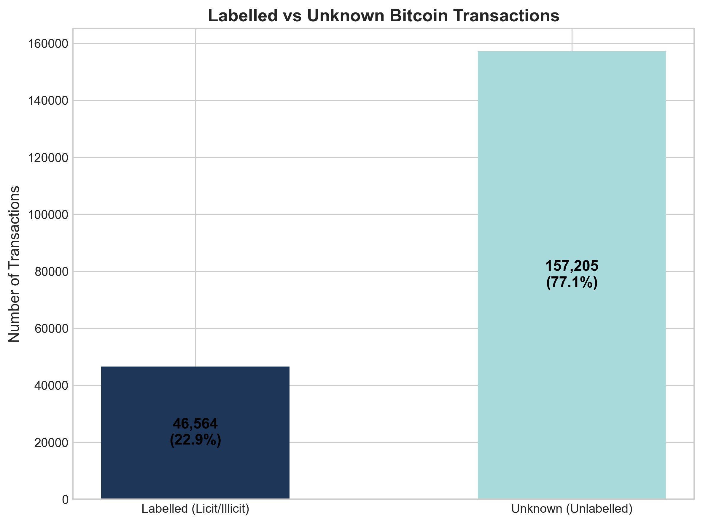
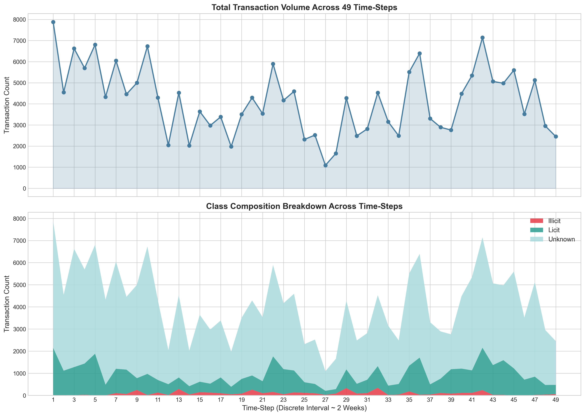
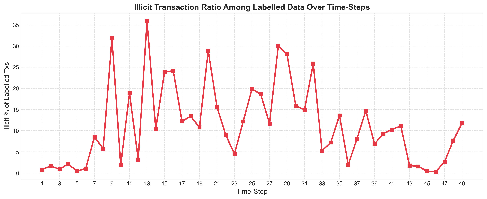
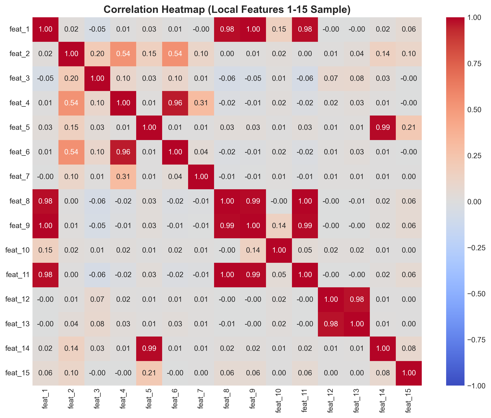
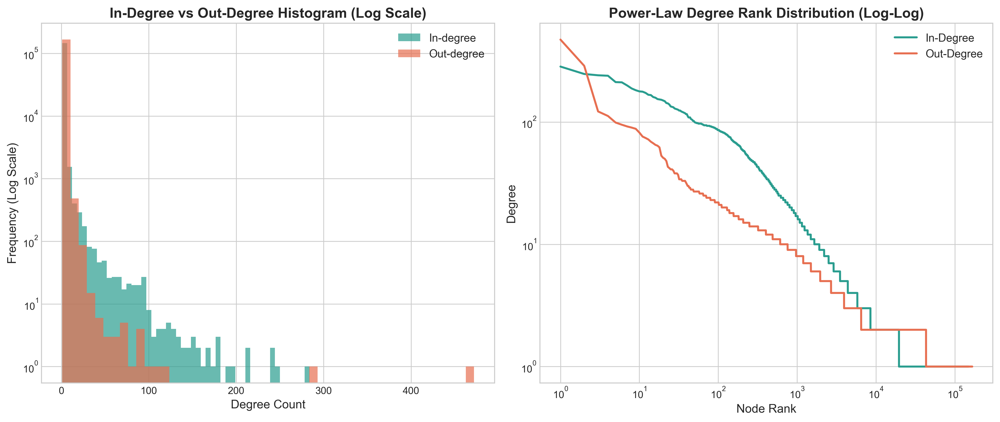
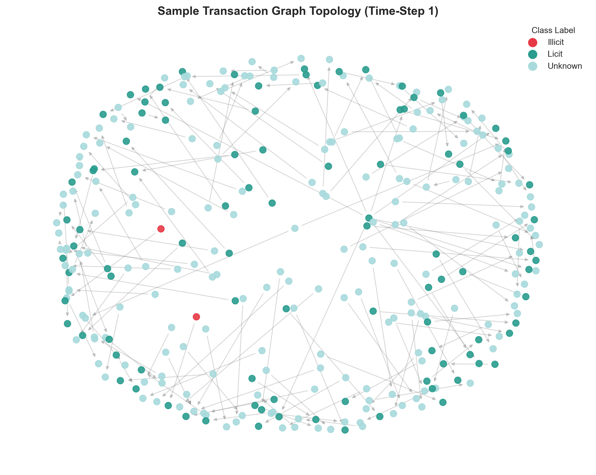

# Comprehensive Exploratory Data Analysis (EDA) Report
## Bitcoin Scam Detection Using Dynamic Graph Neural Networks

**Dataset:** Elliptic Bitcoin Transaction Dataset  
**Generated On:** 2026-09-29  
**Status:** Stage 1 - Initial Setup & Dataset Loading & EDA Completed  

---

## 1. Executive Summary

The **Elliptic Dataset** maps Bitcoin transactions over 49 discrete time-steps into a directed graph structure. Each node represents a transaction, edges represent payments/flows between transactions, and features describe local transaction metrics as well as aggregated neighborhood metrics.

### Key Highlights:
- **Total Transactions (Nodes):** `203,769`
- **Total Directed Edges:** `234,355`
- **Total Time-Steps:** `49`
- **Class Labels Breakdown:**
  - **Illicit (Class 1):** `4,545` (2.23%)
  - **Licit (Class 2):** `42,019` (20.62%)
  - **Unknown (Unlabelled):** `157,205` (77.15%)
- **Illicit Ratio in Labelled Subset:** `9.76%`

---

## 2. Dataset Schema & Validation

### Table Shapes and Columns:
- **Features Table:** `(203769, 168)` (Columns: `txId`, `time_step`, `feat_1` to `feat_166`)
- **Classes Table:** `(203769, 4)` (Columns: `txId`, `class`, `class_name`, `binary_label`)
- **Edges Table:** `(234355, 2)` (Columns: `txId1`, `txId2`)

### Data Integrity & Missingness:
- **Missing Values:**
  - Features Table: `203769` missing cells
  - Classes Table: `0` missing cells
  - Edges Table: `0` missing cells
- **Duplicates:**
  - Duplicate Feature Rows / Node IDs: `0` / `0`
  - Duplicate Class Rows: `0`
  - Duplicate Edges: `0`

---

## 3. Class Distribution & Imbalance Analysis

| Class | Count | Percentage |
|---|---|---|
| **Illicit (1)** | 4,545 | 2.23% |
| **Licit (2)** | 42,019 | 20.62% |
| **Unknown** | 157,205 | 77.15% |
| **Total** | **203,769** | **100.0%** |

> **Key Finding:** The dataset exhibits extreme class imbalance. Illicit transactions account for only ~2.3% of total transactions and ~10.4% of labelled transactions. Unlabelled ("Unknown") nodes constitute ~77.3% of the dataset, making Dynamic GNN semi-supervised learning highly suitable.

---

## 4. Temporal Dynamics Across 49 Time-Steps

- **Min / Max / Mean Txs per Time-Step:** `1,089` / `7,880` / `4,158.55`
- **Time-step Interval:** Each time-step represents a window of approximately 2 weeks of Bitcoin transaction activity.

> **Key Finding:** Time-step 43 exhibits a prominent structural shift due to a major dark market shutdown, leading to a temporary drop in illicit transaction ratio.

---

## 5. Feature Numerical Statistics

- **Total Features:** `166` (94 Local features + 72 Aggregate features)
- **Local Features (1-94):** Mean zero ratio = `0.0%`, Avg Skewness = `27.7842`
- **Aggregate Features (95-166):** Mean zero ratio = `0.0%`, Avg Skewness = `13.4021`

---

## 6. Graph Topological & Network Statistics

- **Graph Type:** Directed Transaction Graph
- **Node Count:** `203,769`
- **Edge Count:** `234,355`
- **Graph Density:** `0.00000564`
- **Isolated Nodes (Degree 0):** `0` (0.00%)
- **Degree Statistics:**
  - **In-Degree (Max / Mean / Std):** `284` / `1.1501` / `3.9111`
  - **Out-Degree (Max / Mean / Std):** `472` / `1.1501` / `1.8947`

---

## 7. Next Stage Readiness

The modular architecture is now ready for:
1. **Stage 2:** Dynamic Graph Construction & Temporal PyTorch Geometric Data Loaders.
2. **Stage 3:** Dynamic GNN Architecture (EvolveGCN / GCN / GAT).
3. **Stage 4:** Model Evaluation & Benchmark Metrics (F1-score, Precision, Recall, AUC-ROC).
4. **Stage 5 & 6:** REST API Backend & Interactive Web Frontend.
